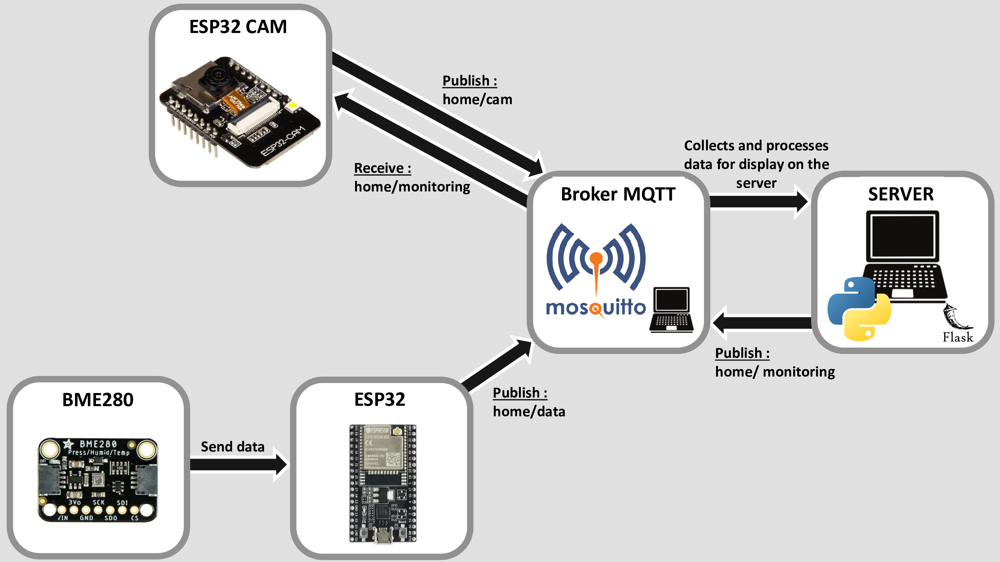

**Project Title: IoT Environmental Monitoring and Surveillance Camera System**

----------------------------------------------------------------------------------------------------
**<mark>Description:</mark>**

This project integrates various IoT components to create a comprehensive environmental monitoring and surveillance system. It uses the ESP32 microcontroller, the ESP32-CAM module, and the BME280 sensor to gather environmental data and surveillance images, transmitting this information to a central server for processing and display.

----------------------------------------------------------------------------------------------------
**<mark>Components:</mark>**

- **BME280 Sensor Interface (BME280_Class.py):** 
        A Python class to interface with the BME280 sensor.
        Used for measuring temperature, humidity, and atmospheric pressure.
        Implements low-level I2C communication with the sensor.

- **ESP32 Data Logger (ESP32.py):** 
        Script for ESP32 microcontroller.
        Connects to WiFi and sends environmental data from the BME280 sensor to a server via MQTT.
        Includes MQTT client setup and unique ID generation for the device.

- **ESP32-CAM Module (ESP32CAM.py):** 
        Python script for handling ESP32-CAM functionalities.
        Connects to WiFi and transmits camera data over the network.
        Uses MQTT for data transmission, with a focus on surveillance or monitoring.

- **Server-Side Application (folder SERVER_FINAL):** 
        Flask web application to receive and display data.
        Handles incoming MQTT messages from both the ESP32 and ESP32-CAM.
        Processes and displays environmental data and images.
        Uses OpenCV for image processing and handling.

----------------------------------------------------------------------------------------------------
**<mark>Installation:</mark>**

- Ensure Python 3.x is installed on your system.
- Install necessary libraries: Flask, paho-mqtt, OpenCV, and NumPy.
- Deploy each script to its corresponding hardware (ESP32, ESP32-CAM).
- Configure network settings (SSID and password) in ESP32 and ESP32-CAM scripts.

----------------------------------------------------------------------------------------------------
**<mark>Flashing the Camera:</mark>**

To use the camera with our system, it is necessary to flash the appropriate firmware onto the ESP32-CAM module. We use the firmware available on lemariva's GitHub repository, which provides a camera driver compatible with MicroPython.
Instructions:

1. Visit the GitHub Repository: 
    Go to lemariva/micropython-camera-driver to access the firmware and detailed instructions.

2. Follow the Instructions: 
    The repository contains detailed instructions on how to flash the firmware onto your ESP32-CAM module. Make sure to follow these instructions carefully.

3. Test the Camera: 
    After flashing, perform tests to confirm that the camera functions correctly with the new firmware.

This firmware is crucial for ensuring the compatibility of the camera with our system and for fully leveraging its capabilities in our environmental surveillance and monitoring project.

----------------------------------------------------------------------------------------------------
**<mark>Usage:</mark>**

- Power up the ESP32 and ESP32-CAM modules.
- Ensure they are connected to the same network as the server.
- Run the server_pub.py script to start the Flask server.
- Access the web interface provided by Flask to view the data and images.
